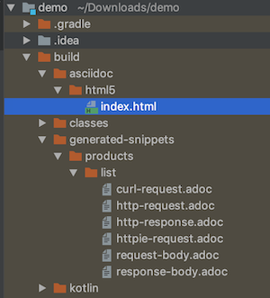

# Getting started with Spring REST Doc

[Spring REST Docs](https://spring.io/projects/spring-restdocs):
 Document RESTful services by combining hand-written documentation with auto-generated snippets produced with Spring MVC Test.

Spring REST Doc creates auto-generated document snippets.
You can integrate it into hand-generated document like this:


## Environment

- Spring Boot 2.1.4
- Gradle 5.2.1
- Kotlin 1.2.71


## Getting Started

### Create Spring Boot Project


Create spring boot project with [Spring Initilizr](https://start.spring.io)

Settings

- Project: **Gradle**
- Language: **Kotlin**
- Dependencies: **Web**, **REST Docs**


### Add `snippetsDir` variable

By default, following error may happen.
```
Could not get unknown property 'snippetsDir' for task ':test' of type org.gradle.api.tasks.testing.Test.
```

Add `snippetsDir` in build.gradle:
```
ext {
	snippetsDir = file('build/generated-snippets')
}

test {
	outputs.dir snippetsDir
}

asciidoctor {
	inputs.dir snippetsDir
	dependsOn test
}
```

### Add Controller

For example, Add `ProductController.kt`:
```
package com.example.demo

import org.springframework.web.bind.annotation.GetMapping
import org.springframework.web.bind.annotation.RequestMapping
import org.springframework.web.bind.annotation.RestController

@RequestMapping("/products")
@RestController
class ProductsController {

    @GetMapping("")
    fun list(): List<Product> {
        return listOf(Product(1, "A"), Product(2, "B"))
    }
}

class Product(
    val id: Int,
    val name: String
)
```

### Add Test

For example, Add `ProductControllerTest.kt`
```
package com.example.demo

import org.junit.Test
import org.junit.runner.RunWith
import org.springframework.beans.factory.annotation.Autowired
import org.springframework.boot.test.autoconfigure.restdocs.AutoConfigureRestDocs
import org.springframework.boot.test.autoconfigure.web.servlet.WebMvcTest
import org.springframework.restdocs.mockmvc.MockMvcRestDocumentation.document
import org.springframework.test.context.junit4.SpringRunner
import org.springframework.test.web.servlet.MockMvc
import org.springframework.test.web.servlet.request.MockMvcRequestBuilders.get
import org.springframework.test.web.servlet.result.MockMvcResultMatchers.status

@RunWith(SpringRunner::class)
@WebMvcTest(ProductController::class)
@AutoConfigureRestDocs
class ProductControllerTest {

    @Autowired
    lateinit var mockMvc: MockMvc

    @Test
    fun read() {
        mockMvc
            .perform(get("/products"))
            .andDo(document("products/{methodName}"))
            .andExpect(status().isOk)
    }
}
```


### Run Test

Run `ProductControllerTest`
```cli
$ ./gradlew test
```

Asciidoc files will be generated:


### Add entry file

You need to add entry file `index.adoc` in `src/doc/ascii/` directory.

For example:
```
# API Document

## Products.list

operation::products/list[snippets='http-request,http-response']
```


### Run asciidoctor

```cli
$ ./gradlew asciidoctor
```

`index.html` will be generated:


### Open index.html in web browser


### Bundle api docs into jar

build.gradle:
```
jar {
	dependsOn asciidoctor
	copy {
		from "${asciidoctor.outputDir}/html5"
		into 'src/main/resources/static/docs'
	}
}
```

## Further Reading
- [Official Reference](https://docs.spring.io/spring-restdocs/docs/2.0.3.RELEASE/reference/html5/)

- [About Spring REST Docs](https://spring.io/projects/spring-restdocs)
